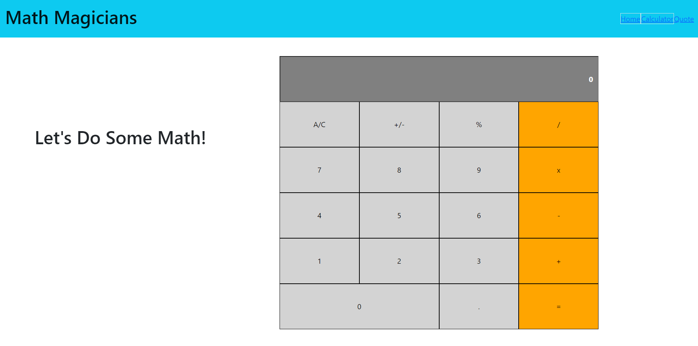

# Calculator App

> An app that does simple arithmetic.

This is a calculator built with React. It does simple arithmetic (addition, multiplication, division, and subtraction).

## Built With

- Javascript, HTML, CSS.
- React & Redux.

## Live Demo

[Crypto Coins](https://relaxed-goldberg-f72b07.netlify.app)

## Getting Started

To run this code locally, follow these simple steps.

- Near the top of the page, there is a green button labeled "Code".
- Click on the "Code" button.
- A Menu will appear. Click on "Download Zip".
- Save the zip file to your computer.
- Extract the contents of the zip you just downloaded into a folder.

## Prerequisites

- nodeJS.
- A browser.

## Setup

- Open your command prompt.
- Go inside the folder you extracted from the zip file.
- Type `npm install`.

## Usage

- Open your command prompt.
- Go inside the folder you extracted from the zip file.
- Type `npm start` (this should open a page in your default browser and the page should load).

## Run tests

- Open your command prompt.
- Go inside the folder you extracted from the zip file.
- Type `npm run test`.

👤 **Paul Clue**

- GitHub: [@PaulClue](https://github.com/Paul-Clue)
- LinkedIn: [Paul Clue](https://www.linkedin.com/in/paul-clue/)

## 🤝 Contributing

Contributions, issues and feature requests are welcome!

## Show your support

Give a ⭐️ if you like this project!

## 📝 License

This project is [MIT](./LICENSE) licensed.
